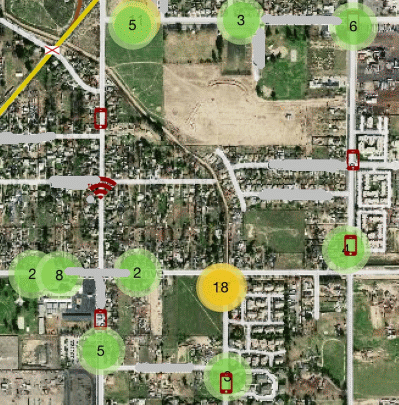
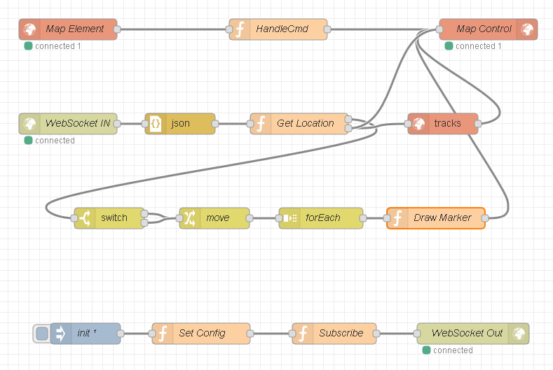

# node signal monitor v 0.0.1

Simple inspection of WiFi networks.

Web Socket Server: wss.js
WiFi Sensor Client: sensor.js


```text
wifi sta -> probe  \    wifi
     wifi data      >  sensor.js  -
wifi ap -> beacon  /    pcap      |
                                wss.js
                                  |
                       MongoDB -- | -- NeDB
node-red leaflet map           -- |
```



# node red map



Currently this flow is primarily for mapping devices while traveling.
Node-red is configured to save context data to disk, but right now nothing else is saved.
The flow requires the node red [worldmap](https://www.npmjs.com/package/node-red-contrib-web-worldmap) node.

TODO:
- [ ] Learn to code
- [x] Convert node-red code to new format and publish flow
- [x] Clarify package requirements, still testing
- [ ] Fix 'empty' SSIDs
- [ ] File logging
- [ ] Simple console UI
- [ ] Easier way to launch/maintain daemons (pm2?)
- [ ] Figure out node-pcap build issues
- [ ] Add NeDB as buffer to MongoDB

This is a continuation of the fascination begun with [sigmon](http://github.com/terbo/sigmon).
